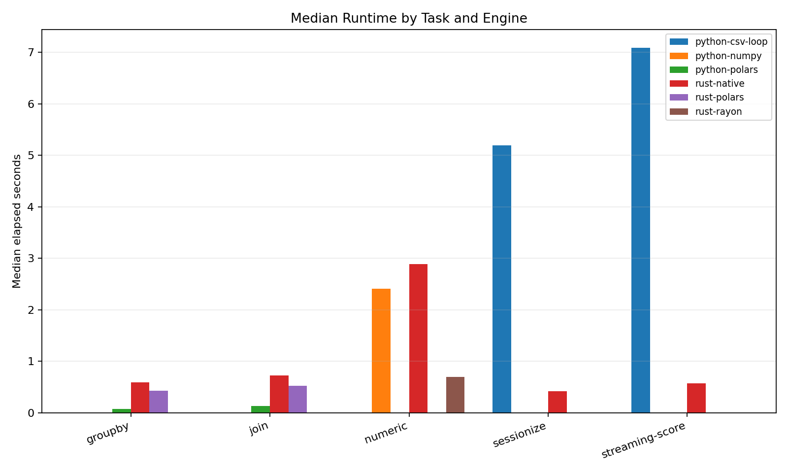
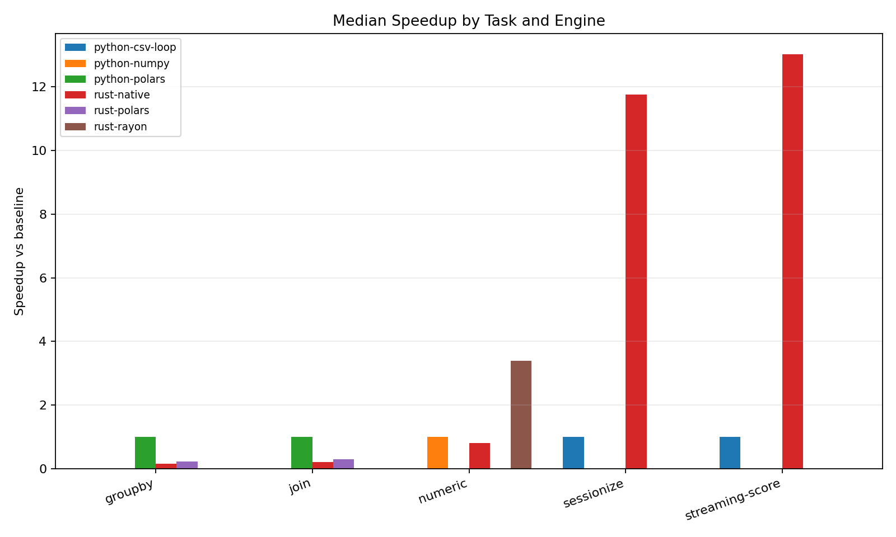
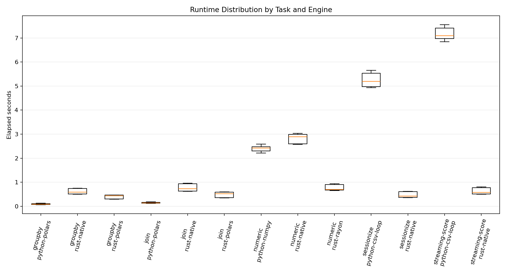

# Python and Rust for Data-Engineering Workloads: A Cross-Machine Benchmark Study

## Introduction

Python and Rust are often compared as if language choice alone determines data-processing performance. In practice, data-engineering pipelines contain several distinct execution patterns. Some workloads spend most of their time inside optimized native kernels exposed through Python libraries such as NumPy or Polars. Others spend more time in application-level loops, mutable state updates, branching logic, CSV parsing, or streaming-style event processing. These cases exercise different parts of the software stack, so a single benchmark can easily overstate or understate the practical benefit of either language.

This report analyzes a benchmark suite designed to separate these cases. The suite compares Python and Rust implementations of five data-engineering workloads: a numeric vectorized kernel, two dataframe-style Polars workloads, a loop-heavy sessionization workload, and a streaming/stateful event-scoring workload. The benchmark was run on three machines: an AMD Ryzen AI Max+ 395 system, an Apple M3 Max MacBook Pro running macOS Tahoe 26.4.1, and an AMD Ryzen 9 7940HS Ubuntu 25.10 system.

The central question is not whether Python or Rust is universally faster. Instead, the study asks where each runtime and library stack performs well under realistic data-engineering patterns. The results show a clear division: Python with mature vectorized or dataframe libraries is highly competitive and fastest for the Polars groupby and join tasks, while Rust is much faster for custom loop-heavy and streaming-style logic. Rust with Rayon is also faster than NumPy for the numeric kernel in this benchmark.

## Method

### Benchmark Environment

The benchmark corpus consists of 780 timing rows from `results/benchmark_runs.csv`. Each machine contributed one suite run, and each task/engine combination was repeated 20 times. Median elapsed time is used as the primary statistic because it is less sensitive to isolated timing noise than the minimum or mean. Speedup is computed as the task-specific Python baseline median divided by the candidate engine median on the same machine and suite run.

| Host label | CSV hostname | Processor | OS label used in report | Architecture / CPU count |
| --- | --- | --- | --- | --- |
| `brb-10732` | `brb-10732.apn.wlan.private.upenn.edu` | AMD Ryzen AI Max+ 395 | Fedora 43 | x86_64 / 32 |
| `sae-hwans-mbp` | `sae-hwans-mbp.pmacs.upenn.edu` | Apple M3 Max | macOS Tahoe 26.4.1 | arm64 / 16 |
| `saehwan-F7BSC` | `saehwan-F7BSC` | AMD Ryzen 9 7940HS | Ubuntu 25.10 | x86_64 / 16 |

### Workloads and Engines

The suite covers five workload classes. The numeric task computes a haversine-like transform and summary statistics over 50 million values. The groupby and join tasks operate over 5 million fact rows and use aligned Python and Rust Polars plans where possible. The sessionization task processes 5 million sorted event rows with row-by-row state transitions. The streaming-score task processes 5 million append-ordered event rows with per-user mutable state and micro-batch-style chunk counters.

| Workload | Engines compared | Baseline for speedup | Input scale | Pattern represented |
| --- | --- | --- | --- | --- |
| `numeric` | `python-numpy`, `rust-native`, `rust-rayon` | `python-numpy` | 50,000,000 values | Vectorized numeric kernel |
| `groupby` | `python-polars`, `rust-polars`, `rust-native` | `python-polars` | 5,000,000 fact rows | Dataframe aggregation |
| `join` | `python-polars`, `rust-polars`, `rust-native` | `python-polars` | 5,000,000 fact rows, 100,000 dimension rows | Dataframe join and aggregation |
| `sessionize` | `python-csv-loop`, `rust-native` | `python-csv-loop` | 5,000,000 event rows | Stateful row loop |
| `streaming-score` | `python-csv-loop`, `rust-native` | `python-csv-loop` | 5,000,000 event rows | Streaming-style mutable state |

The Polars tasks compare Python and Rust frontends to a similar dataframe engine rather than comparing pure Python loops to Rust. The sessionization and streaming tasks deliberately avoid dataframe-friendly formulations and instead emphasize custom control flow, per-row parsing, mutable state, and branching. This distinction is important because these two families measure different engineering choices: library-oriented query execution versus custom application-level hot paths.

### Analysis Procedure

The analysis groups rows by task, engine, hostname, and suite run. For each group, it computes count, minimum, median, mean, standard deviation, best recorded time, and speedup relative to the task baseline. The existing generated analysis in `results/analysis/report.md` provides the full statistics table. This manuscript summarizes the same data in compact form and uses the existing figures in `results/analysis/`.

## Results

### Overall Runtime Patterns

The median runtime chart shows three broad regimes. First, Python Polars is the fastest option for the dataframe groupby and join workloads on all three machines. Second, Rust Rayon is the fastest option for the numeric kernel, while single-threaded native Rust is roughly comparable to or slower than NumPy. Third, native Rust is much faster than Python CSV loops for sessionization and streaming-score workloads.

| Task | `brb-10732` fastest median | `sae-hwans-mbp` fastest median | `saehwan-F7BSC` fastest median |
| --- | ---: | ---: | ---: |
| `groupby` | `python-polars`, 0.0790 s | `python-polars`, 0.0684 s | `python-polars`, 0.1155 s |
| `join` | `python-polars`, 0.1348 s | `python-polars`, 0.1240 s | `python-polars`, 0.1699 s |
| `numeric` | `rust-rayon`, 0.6999 s | `rust-rayon`, 0.6654 s | `rust-rayon`, 0.9092 s |
| `sessionize` | `rust-native`, 0.3657 s | `rust-native`, 0.6059 s | `rust-native`, 0.4213 s |
| `streaming-score` | `rust-native`, 0.5053 s | `rust-native`, 0.7770 s | `rust-native`, 0.5725 s |

### Speedups Relative to Python Baselines

The largest speedups occur in loop-heavy workloads. Native Rust sessionization is 15.14x faster than the Python CSV loop on the Ryzen AI Max+ 395, 8.57x faster on the M3 Max, and 11.76x faster on the Ryzen 9 7940HS. The streaming-score workload shows a similar pattern: 14.03x, 8.89x, and 13.03x faster on the same machines.

The numeric kernel is more nuanced. Rust with Rayon is 3.57x faster than NumPy on the Ryzen AI Max+ 395, 3.40x faster on the M3 Max, and 2.65x faster on the Ryzen 9 7940HS. However, native Rust without Rayon is not a clear improvement over NumPy; it is slightly slower than NumPy on the M3 Max and Ryzen 9 7940HS, and roughly comparable on the Ryzen AI Max+ 395. In this benchmark, the Rust numeric advantage comes from a parallel execution strategy rather than from a scalar Rust implementation alone.

The dataframe workloads show the opposite result. Python Polars is the baseline and fastest implementation for both groupby and join on every machine. Rust Polars reaches only 0.18x to 0.25x of Python Polars speed for groupby and 0.26x to 0.35x for join. The native Rust groupby and join implementations are also slower than Python Polars in these runs. This result should be interpreted as a property of these implementations, Polars frontends, feature flags, CSV scan behavior, and library versions, not as a general limit of Rust.

| Task | Fastest engine | Speedup range vs baseline across machines |
| --- | --- | ---: |
| `groupby` | `python-polars` | 1.00x baseline |
| `join` | `python-polars` | 1.00x baseline |
| `numeric` | `rust-rayon` | 2.65x-3.57x |
| `sessionize` | `rust-native` | 8.57x-15.14x |
| `streaming-score` | `rust-native` | 8.89x-14.03x |

### Runtime Variability

The runtime distribution plot indicates that most task/engine groups have relatively tight timing distributions across 20 repeats. The generated summary table reports standard deviations that are generally small relative to the median for the fastest implementations. Examples include Rust sessionization on the Ryzen AI Max+ 395 with median 0.3657 s and standard deviation 0.0019 s, and Rust streaming-score on the Ryzen 9 7940HS with median 0.5725 s and standard deviation 0.0028 s.

The Python Polars dataframe tasks show more visible variation than the tightest native Rust loop workloads, but the rank ordering remains stable: Python Polars is fastest for groupby and join on all three machines. The Python CSV loop tasks also remain consistently much slower than their Rust counterparts, so the main loop-heavy conclusion does not depend on an isolated best-case run.

### Cross-Machine Comparisons

The fastest machine depends on the workload. The M3 Max records the best medians for the Python Polars groupby and join tasks and the Rust Rayon numeric task. The Ryzen AI Max+ 395 records the best Rust native medians for the sessionization and streaming-score tasks. The Ryzen 9 7940HS is slower than the other two machines on the Polars and numeric winners, but it remains substantially faster than the M3 Max on the Rust native sessionization and streaming workloads.

These cross-machine differences suggest that the benchmark is sensitive to both CPU architecture and implementation details such as threading, memory behavior, CSV parsing, and branch-heavy state updates. The results should therefore be read as a comparison of concrete machine/software stacks rather than as a hardware-normalized language ranking.

## Discussion

The results support a practical distinction between library-bound and application-loop-bound data engineering. For dataframe-style operations, Python can be very fast when the hot path is delegated to a mature native engine. In this benchmark, Python Polars dominates both groupby and join, despite Rust being the implementation language of much of the underlying ecosystem. The Python code benefits from Polars' optimized query engine while exposing a concise frontend, and the measured runtime is dominated by library execution rather than Python bytecode.

For custom row-wise state machines, Rust has a large advantage. Sessionization and streaming-score both require per-record control flow, mutable state, and branching. These are cases where Python's interpreter overhead and object model are more exposed, while Rust can compile the hot path into native code with predictable memory and control-flow behavior. The 8.57x to 15.14x Rust speedup range across these workloads is large enough to change system design decisions: a service or batch job that is dominated by this kind of logic may benefit from moving the hot loop into Rust or another compiled component.

The numeric benchmark shows that implementation strategy matters as much as language. NumPy is a strong baseline because it already executes vectorized native kernels. Rust without Rayon does not consistently beat it. Rust with Rayon does, because the implementation exploits parallelism across cores. This suggests that "Rust versus Python" is too coarse a framing for numeric workloads; the relevant comparison is often between specific vectorized and parallel execution strategies.

The Rust Polars results deserve caution. The Rust Polars implementations are slower than Python Polars here, but that does not mean Rust is intrinsically slower for dataframe execution. Plausible contributors include frontend defaults, Polars version differences, feature flags, CSV scan settings, projection behavior, and thread-pool configuration. The README notes that the Python and Rust Polars plans are intentionally aligned, but not guaranteed to be internally identical. A deeper Polars-specific study would need to pin versions, inspect optimized physical plans, control thread counts, and isolate CSV scanning from query execution.

The study has several limitations. The data is synthetic, so it may not represent production distributions, compression formats, storage systems, or skew patterns. Each machine contributed one suite run, so the study does not capture day-to-day environmental variation. The measurements use elapsed time and do not report CPU utilization, memory bandwidth, cache behavior, allocation counts, or energy consumption. The benchmark also compares concrete implementations rather than all possible Python and Rust implementations. A different Python approach using Cython, Numba, PyArrow, DuckDB, or Polars streaming mode could change some outcomes; likewise, more optimized Rust native dataframe code could narrow or reverse some gaps.

Within those limits, the results give a consistent engineering conclusion. Python remains an excellent choice when a workload can be expressed in high-level operations handled by optimized libraries. Rust becomes compelling when the performance-critical section is custom, stateful, branch-heavy, or streaming-oriented. For mixed data-engineering systems, the strongest design may not be a full rewrite in either direction, but a hybrid architecture: keep Python for orchestration and library-backed analytics, and move the narrow hot paths that resist vectorization into Rust.
