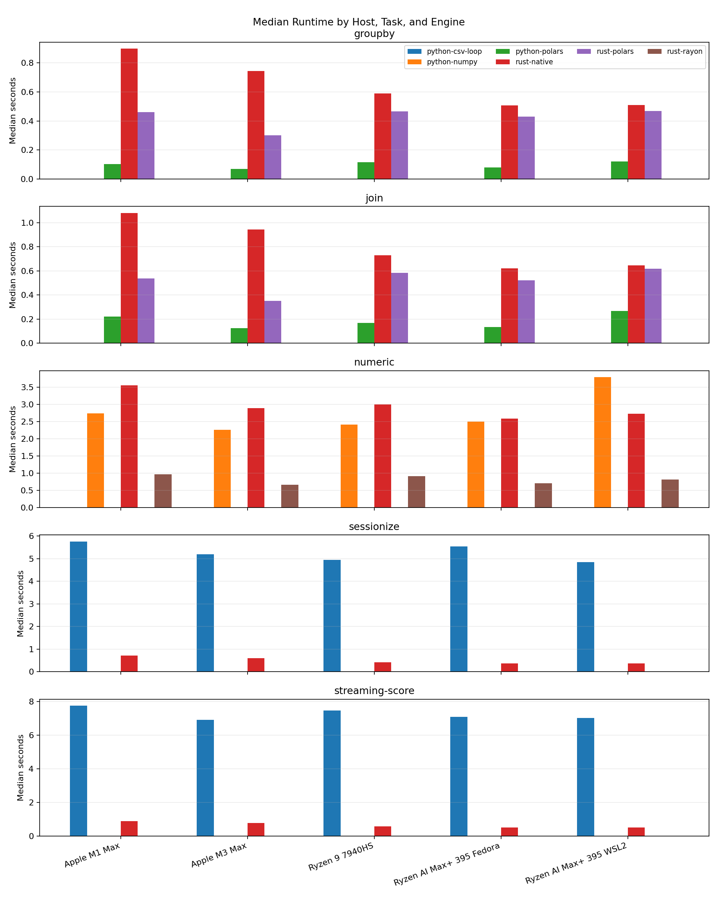
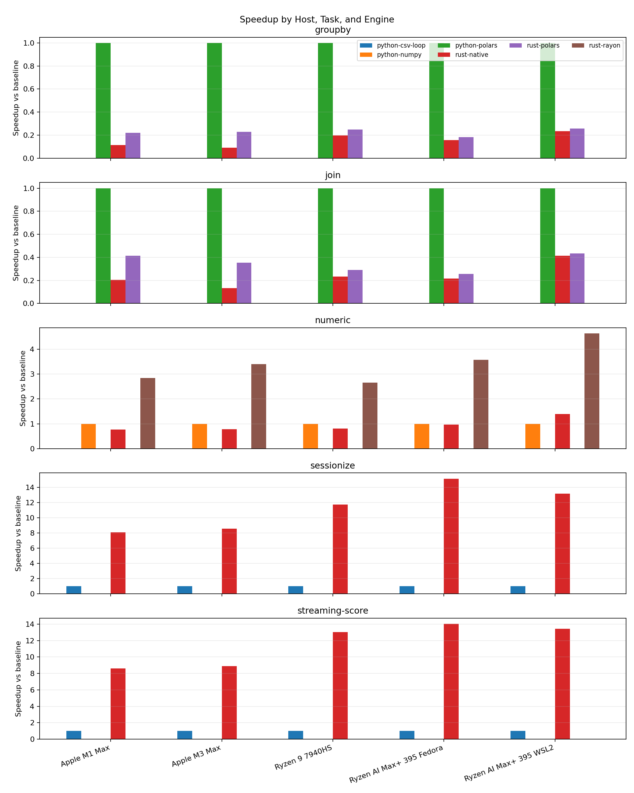
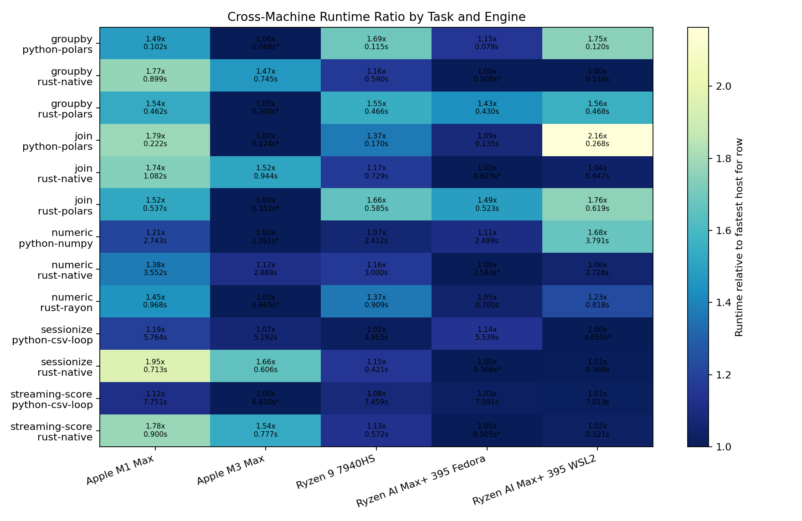

# Python and Rust for Data-Engineering Workloads: A Cross-Machine Benchmark Study

## Introduction

Python and Rust are often compared as if language choice alone determines data-processing performance. In practice, data-engineering pipelines contain several distinct execution patterns. Some workloads spend most of their time inside optimized native kernels exposed through Python libraries such as NumPy or Polars. Others spend more time in application-level loops, mutable state updates, branching logic, CSV parsing, or streaming-style event processing. These cases exercise different parts of the software stack, so a single benchmark can easily overstate or understate the practical benefit of either language.

This study analyzes a benchmark suite designed to separate these cases. The suite compares Python and Rust implementations of five data-engineering workloads: a numeric vectorized kernel, two dataframe-style Polars workloads, a loop-heavy sessionization workload, and a streaming/stateful event-scoring workload. The benchmark now includes five machine/software stacks: Apple M1 Max and M3 Max systems on Darwin 25.4.0, two AMD Ryzen AI Max+ 395 runs on Fedora 43-class Linux environments, and an AMD Ryzen 9 7940HS Ubuntu system. One Ryzen AI Max+ 395 run is native Fedora 43, while the other is Fedora 43 userland under WSL2 on Windows 11.

The central question is not whether Python or Rust is universally faster. Instead, the study asks where each runtime and library stack performs well under realistic data-engineering patterns. The expanded dataset strengthens the same broad conclusion: Python with mature dataframe libraries is fastest for the Polars groupby and join tasks, Rust with Rayon is fastest for the numeric kernel, and native Rust has the largest advantage for custom loop-heavy and streaming-style logic.

## Method

### Benchmark Environment

The benchmark corpus consists of 1,300 timing rows from `results/benchmark_runs.csv`. Each machine contributed one suite run, and each task/engine combination was repeated 20 times. Median elapsed time is used as the primary statistic because it is less sensitive to isolated timing noise than the minimum or mean. Speedup is computed as the task-specific Python baseline median divided by the candidate engine median on the same machine and suite run.

| Host label | CSV hostname | Processor | OS label used in report | Architecture / CPU count |
| --- | --- | --- | --- | --- |
| Apple M1 Max | `Sae-Hwans-Mac-Studio-M1Max.local` | Apple M1 Max | Darwin 25.4.0 | arm64 / 10 |
| Apple M3 Max | `sae-hwans-mbp.pmacs.upenn.edu` | Apple M3 Max | Darwin 25.4.0 | arm64 / 16 |
| Ryzen 9 7940HS | `saehwan-F7BSC` | AMD Ryzen 9 7940HS | Linux 6.17.0-23-generic | x86_64 / 16 |
| Ryzen AI Max+ 395 Fedora | `brb-10732.apn.wlan.private.upenn.edu` | AMD Ryzen AI Max+ 395 | Linux 6.19.14-200.fc43.x86_64 | x86_64 / 32 |
| Ryzen AI Max+ 395 WSL2 | `NucBoxEVO-X2` | AMD Ryzen AI Max+ 395 | Linux 6.6.87.2-microsoft-standard-WSL2 | x86_64 / 32 |

### Workloads and Engines

The suite covers five workload classes. The numeric task computes a haversine-like transform and summary statistics over 50 million values. The groupby and join tasks operate over 5 million fact rows and use aligned Python and Rust Polars plans where possible. The sessionization task processes 5 million sorted event rows with row-by-row state transitions. The streaming-score task processes 5 million append-ordered event rows with per-user mutable state and micro-batch-style chunk counters.

| Workload | Engines compared | Baseline for speedup | Input scale | Pattern represented |
| --- | --- | --- | --- | --- |
| `numeric` | `python-numpy`, `rust-native`, `rust-rayon` | `python-numpy` | 50,000,000 values | Vectorized numeric kernel |
| `groupby` | `python-polars`, `rust-polars`, `rust-native` | `python-polars` | 5,000,000 fact rows | Dataframe aggregation |
| `join` | `python-polars`, `rust-polars`, `rust-native` | `python-polars` | 5,000,000 fact rows, 100,000 dimension rows | Dataframe join and aggregation |
| `sessionize` | `python-csv-loop`, `rust-native` | `python-csv-loop` | 5,000,000 event rows | Stateful row loop |
| `streaming-score` | `python-csv-loop`, `rust-native` | `python-csv-loop` | 5,000,000 event rows | Streaming-style mutable state |

The Polars tasks compare Python and Rust frontends to a similar dataframe engine rather than comparing pure Python loops to Rust. The sessionization and streaming tasks deliberately avoid dataframe-friendly formulations and instead emphasize custom control flow, per-row parsing, mutable state, and branching. This distinction is important because these two families measure different engineering choices: library-oriented query execution versus custom application-level hot paths.

### Analysis Procedure

The analysis groups rows by task, engine, hostname, and suite run. For each group, it computes count, minimum, median, mean, standard deviation, best recorded time, and speedup relative to the task baseline. The generated analysis in `results/analysis/report.md` provides the full statistics table and host inventory. This manuscript summarizes the same data and uses the generated figures in `results/analysis/`.

## Results

### Overall Runtime Patterns

Across all five hosts, the fastest engine choice is stable by workload class. Python Polars is fastest for both dataframe workloads on every host. Rust Rayon is fastest for the numeric task on every host. Native Rust is fastest for both stateful row-processing workloads on every host.

| Task | Apple M1 Max fastest | Apple M3 Max fastest | Ryzen 9 7940HS fastest | Ryzen AI Max+ 395 Fedora fastest | Ryzen AI Max+ 395 WSL2 fastest |
| --- | ---: | ---: | ---: | ---: | ---: |
| `groupby` | `python-polars`, 0.1016 s | `python-polars`, 0.0684 s | `python-polars`, 0.1155 s | `python-polars`, 0.0790 s | `python-polars`, 0.1200 s |
| `join` | `python-polars`, 0.2216 s | `python-polars`, 0.1240 s | `python-polars`, 0.1699 s | `python-polars`, 0.1348 s | `python-polars`, 0.2684 s |
| `numeric` | `rust-rayon`, 0.9675 s | `rust-rayon`, 0.6654 s | `rust-rayon`, 0.9092 s | `rust-rayon`, 0.6999 s | `rust-rayon`, 0.8184 s |
| `sessionize` | `rust-native`, 0.7132 s | `rust-native`, 0.6059 s | `rust-native`, 0.4213 s | `rust-native`, 0.3657 s | `rust-native`, 0.3683 s |
| `streaming-score` | `rust-native`, 0.8996 s | `rust-native`, 0.7770 s | `rust-native`, 0.5725 s | `rust-native`, 0.5053 s | `rust-native`, 0.5213 s |

The host-aware runtime chart makes the hardware pattern visible:

The Apple M3 Max records the best overall medians for Python Polars groupby, Python Polars join, and Rust Rayon numeric. The native Fedora Ryzen AI Max+ 395 records the best overall medians for Rust native sessionization and streaming-score. The WSL2 Ryzen AI Max+ 395 is close to native Fedora for the Rust native loop workloads, but it is materially slower for the Polars tasks and Rust Rayon numeric.

### Speedups Relative to Python Baselines

The largest speedups still occur in loop-heavy workloads. Native Rust sessionization is 8.08x to 15.14x faster than the Python CSV loop, depending on host. Native Rust streaming-score is 8.62x to 14.03x faster. These ranges remain large across both Apple Silicon and AMD x86_64 systems.

The numeric kernel is more nuanced. Rust with Rayon is 2.65x to 4.63x faster than NumPy across the five hosts. However, native Rust without Rayon does not consistently beat NumPy: it is faster on the WSL2 Ryzen AI Max+ 395 run, roughly comparable on native Fedora Ryzen AI Max+ 395, and slower on the Apple and Ryzen 9 7940HS runs. In this benchmark, the Rust numeric advantage comes primarily from the parallel execution strategy rather than from scalar Rust alone.

The dataframe workloads show the opposite result. Python Polars is the baseline and fastest implementation for both groupby and join on every host. Rust Polars reaches only a fraction of Python Polars speed in these runs, and the native Rust groupby and join implementations are also slower than Python Polars. This result should be interpreted as a property of these concrete implementations, Polars frontends, feature flags, CSV scan behavior, and library versions, not as a general limit of Rust.

| Task | Fastest engine | Speedup range vs baseline across hosts |
| --- | --- | ---: |
| `groupby` | `python-polars` | 1.00x baseline |
| `join` | `python-polars` | 1.00x baseline |
| `numeric` | `rust-rayon` | 2.65x-4.63x |
| `sessionize` | `rust-native` | 8.08x-15.14x |
| `streaming-score` | `rust-native` | 8.62x-14.03x |

### Runtime Variability

The runtime distribution plot indicates that most task/engine groups have relatively tight timing distributions across 20 repeats per host. The generated summary table reports small standard deviations for the fastest loop implementations, such as Rust sessionization on native Fedora Ryzen AI Max+ 395 with median 0.3657 s and standard deviation 0.0019 s, and Rust streaming-score on the Ryzen 9 7940HS with median 0.5725 s and standard deviation 0.0028 s.

Some Python Polars runs show more visible variation than the tightest native Rust loop workloads, especially on the WSL2 and M1 Max additions. The rank ordering remains stable: Python Polars is fastest for groupby and join on all five hosts. The Python CSV loop tasks also remain consistently much slower than their Rust counterparts, so the main loop-heavy conclusion does not depend on an isolated best-case run.

### Cross-Machine Comparisons

The fastest machine depends on the workload. The M3 Max leads the high-level library-backed winners: Python Polars groupby, Python Polars join, and Rust Rayon numeric. The native Fedora Ryzen AI Max+ 395 leads the native Rust loop workloads and is effectively tied with the WSL2 Ryzen AI Max+ 395 for Rust native sessionization. The Ryzen 9 7940HS is behind the leading M3 Max and Ryzen AI Max+ 395 results, but it remains substantially faster than the Apple systems on Rust native sessionization and streaming-score.

The two newest checkpoints add two useful contrasts. First, the M1 Max follows the same Apple Silicon pattern as the M3 Max but trails it consistently, with especially visible gaps in Polars join, Rust Rayon numeric, and Rust native loop throughput. Second, the WSL2 Ryzen AI Max+ 395 shows that the same processor family can look different under a different OS/virtualization stack: it is close to native Fedora for native Rust loops, but slower for Polars tasks and numeric parallel work. These differences suggest sensitivity to thread scheduling, memory behavior, filesystem or CSV scanning paths, and library/runtime configuration.

## Discussion

The results support a practical distinction between library-bound and application-loop-bound data engineering. For dataframe-style operations, Python can be very fast when the hot path is delegated to a mature native engine. In this benchmark, Python Polars dominates both groupby and join despite Rust being central to the underlying ecosystem. The measured runtime is dominated by library execution rather than Python bytecode.

For custom row-wise state machines, Rust has a large advantage. Sessionization and streaming-score both require per-record control flow, mutable state, and branching. These are cases where Python's interpreter overhead and object model are more exposed, while Rust can compile the hot path into native code with predictable memory and control-flow behavior. The 8.08x to 15.14x Rust speedup range across these workloads is large enough to change system design decisions: a service or batch job dominated by this kind of logic may benefit from moving the hot loop into Rust or another compiled component.

The numeric benchmark shows that implementation strategy matters as much as language. NumPy is a strong baseline because it already executes vectorized native kernels. Rust without Rayon is not a universal improvement. Rust with Rayon is consistently faster because the implementation exploits parallelism across cores. This suggests that "Rust versus Python" is too coarse a framing for numeric workloads; the relevant comparison is often between specific vectorized and parallel execution strategies.

The Rust Polars results deserve caution. The Rust Polars implementations are slower than Python Polars here, but that does not mean Rust is intrinsically slower for dataframe execution. Plausible contributors include frontend defaults, Polars version differences, feature flags, CSV scan settings, projection behavior, and thread-pool configuration. A deeper Polars-specific study would need to pin versions, inspect optimized physical plans, control thread counts, and isolate CSV scanning from query execution.

The study has several limitations. The data is synthetic, so it may not represent production distributions, compression formats, storage systems, or skew patterns. Each machine contributed one suite run, so the study does not capture day-to-day environmental variation. The measurements use elapsed time and do not report CPU utilization, memory bandwidth, cache behavior, allocation counts, or energy consumption. The benchmark also compares concrete implementations rather than all possible Python and Rust implementations. A different Python approach using Cython, Numba, PyArrow, DuckDB, or Polars streaming mode could change some outcomes; likewise, more optimized Rust native dataframe code could narrow or reverse some gaps.

Within those limits, the results give a consistent engineering conclusion. Python remains an excellent choice when a workload can be expressed in high-level operations handled by optimized libraries. Rust becomes compelling when the performance-critical section is custom, stateful, branch-heavy, or streaming-oriented. For mixed data-engineering systems, the strongest design may not be a full rewrite in either direction, but a hybrid architecture: keep Python for orchestration and library-backed analytics, and move the narrow hot paths that resist vectorization into Rust.
